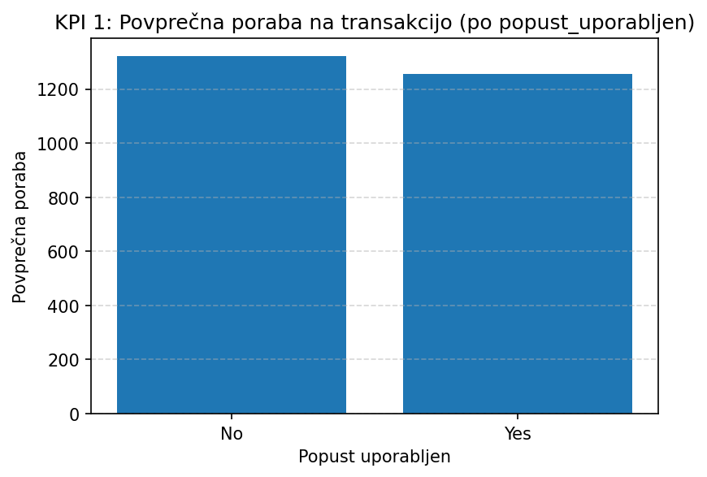
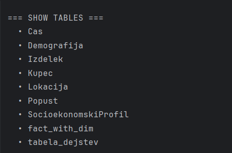

**DuckDB-podprta OLAP kocka in vizualizacija KPI-jev****Raziskovanje digitalnega nakupovalnega vedenja potrošnikov****Ekipa 6 (Emilija Mitrović, Vanja Pajović, Bogdan Kaščelan)**

**1\. Pregled**

Ta projekt uvozi osem dimenzijskih in dejstvenih tabel izMySQL sheme (dwpikp) v DuckDB, izdela pogled v obliki zvezdaste sheme z imenom fact_with_dim, izračuna tri ključne KPI-je in jih vizualizira z matplotlib.Priložena so vsa koda, DuckDB baza ter posnetki zaslona.

Delovni tok poteka takole:

*   Branje MySQL tabel v pandas DataFrame-e
    

*   Shranjevanje tabel v DuckDB datoteko (duckdb\_database/dwpikp.duckdb)
    

*   Ustvarjanje pogleda fact\_with\_dim, ki povezuje dejstveno tabelo z dimenzijami (vključno s kupec\_id za KPI3)
    

*   Izračun KPI 1, KPI 2 in KPI 3 (z razdelavo raziskovalnih vprašanj)
    

*   Generiranje in izvoz treh PNG grafov v mapo documentation/screenshots/: 

– KPI 1: Povprečna poraba glede na uporabo popusta

– KPI 2: Stopnja konverzije skozi čas

– KPI 3: Delež strank po starostnih skupinah

**2\. Shema v DuckDB**

Slika 1 Rezultat ukaza SHOW TABLES; vDuckDB, ki prikazuje vse dimenzijske in dejstvene tabele ter pogledfact\_with\_dim.

**3\. Vzorčne vrstice iz fact\_with\_dim**

Slika 2 Primer 5 vrstic iz združenegapogleda fact\_with\_dim, ki prikazuje atribute dimenzij in mere dejstev.